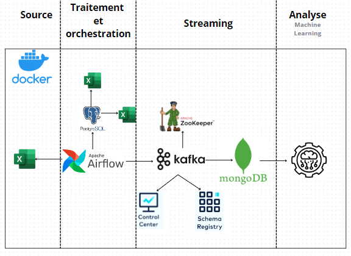

# Automated Data Processing System and Customer Clustering Analysis

## Overview
- [Project Description](#project-description)
- [Technologies](#technologies)
- [Installation](#installation)
- [Execution](#execution)
- [Pipeline Architecture](#pipeline-architecture)
- [Results and Visualizations](#results-and-visualizations)
- [Author](#author)

## Project Description

This project aims to implement an automated system that:
- **Extracts** data from Excel files related to stock movements and deliveries.
- **Stores** this data in a relational database (**PostgreSQL**) for stock movements and a **NoSQL (MongoDB)** database for deliveries.
- **Analyzes** and segments customer data using clustering algorithms such as **K-means** and **DBSCAN**.
- **Visualizes** the results through interactive graphs.

## Technologies

The project leverages the following technologies:

- **Python**: Main language for data processing and machine learning.
- **Apache Kafka**: Manages real-time data streaming between pipeline stages.
- **Apache Airflow**: Orchestrates the workflow of data processing tasks.
- **PostgreSQL**: Relational database for stock management.
- **MongoDB**: NoSQL database for delivery data.
- **Pandas**: Data manipulation using DataFrames.
- **Scikit-learn**: Machine learning algorithms for customer clustering.
- **Plotly**: Data visualization library.
- **Docker**: Containerization to streamline pipeline deployment.

## Installation

### Prerequisites

1. **Docker** and **Docker Compose** must be installed on your machine.
2. **Python 3.9+** should be installed if running locally without Docker.
3. Install **PostgreSQL** and **MongoDB** on your machine or configure a remote server if necessary.

### Installation Steps

1. Clone the project repository:
    ```bash
    git clone https://github.com/SaidDazz/Automated-data-processing-system-and-customer-clustering-analysis.git
    ```

2. Navigate to the project directory:
    ```bash
    cd Automated-data-processing-system-and-customer-clustering-analysis
    ```

3. Build the Docker services:
    ```bash
    docker-compose up --build
    ```

4. Start the Docker services:
    ```bash
    docker-compose up -d
    ```

5. Install Python dependencies:
    ```bash
    pip install -r requirements.txt
    ```

6. Access the Airflow web interface via:
    ```bash
    http://localhost:8080
    ```
    **Default credentials:**
    - Username: `airflow`
    - Password: `airflow`

7. Configure the databases:
    - PostgreSQL: Use the `schema.sql` file to create the required tables.
    - MongoDB: Ensure the stock and delivery collections are properly set up.

8. Set up Kafka for real-time data streaming (already integrated in Docker Compose).

## Execution

### Orchestration with Airflow

1. Initialize Airflow:
    ```bash
    airflow db init
    airflow users create --username airflow --password airflow --role Admin
    ```

2. Start the scheduler and Airflow webserver:
    ```bash
    airflow scheduler
    airflow webserver
    ```

3. Enable and monitor the DAG corresponding to the stock and delivery management pipeline.

### Running the Clustering Script

1. Run the analysis script to apply customer clustering:
    ```bash
    docker exec -it airflow_worker python clustering.py
    ```

### Generating Visualizations

1. Visualize the generated graphs after processing:
    ```bash
    docker exec -it airflow_worker python visualize_data.py
    ```

## Pipeline Architecture

The project follows an automated data pipeline architecture that integrates:

1. **Data extraction** from Excel files.
2. **Transformation and cleaning** of data using Python.
3. **Storage** in PostgreSQL for stock tracking and MongoDB for deliveries.
4. **Real-time streaming** using Apache Kafka between pipeline components.
5. **Customer clustering** using K-means and DBSCAN algorithms.
6. **Interactive visualization** of the results.



## Results and Visualizations

Key outcomes of the analysis include:

- **Customer clustering** using DBSCAN and K-means to enable better segmentation for decision-making.
- **Interactive reports** visualizing stock movements and deliveries.

Example visualizations:

### 1. DBSCAN Clustering


### 2. Country Distribution


## Conclusion

This project offers a comprehensive solution for automating stock and delivery management by integrating modern tools such as **Apache Airflow**, **Kafka**, **MongoDB**, and **PostgreSQL**. Furthermore, it applies **machine learning** techniques to analyze and segment customer data, providing valuable insights for decision-making.

## Author
- DAZZAZI Ahmed Said - Data Engineer - [GitHub](https://github.com/SaidDazz)
